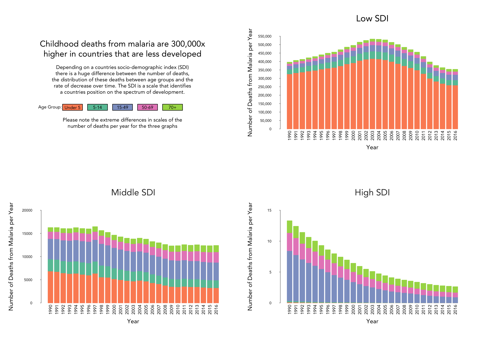

# Data Visualization 

This portfolio is for Data Visualisation and Analytics (C7083). It comprises of twelve data visualisation from three different data sources. There is a short introduction to each dataset, as well as some notes about each visualisation. I have included my own personal thoughts and areas I would like to revisit in the future to improve on for each visualisation.

(https://florencegalliers.github.io/datavisualization/)

The GitHub Repository containing all data and code for the plots can be found here : (https://github.com/FlorenceGalliers/datavisualization)

Contents:

[1. Carbon Emissions and Food Consumption](#1-carbon-emissions-and-food-consumption)

   -  [1.1 Interactive Shiny App: CO2 Emission Comparisons](#11-interactive-shiny-app)

   -  [1.2 Base R Graphics: Food Consumption (Boxplot and Strip-Chart)](#12-base-r-graphics)

   -  [1.3 ggplot2: Carbon Emissions caused by Meat](#13-ggplot2)

   -  [1.4 Spatial Data with ggplot: Dairy Consumption in Europe](#14-spatial-data-with-ggplot)

[2. Meteorites](#2-meteorites)

   -  [2.1 Base R Graphics: Meteorites falling over time](#21-base-r-graphics)

   -  [2.2 ggplot2: Largest 20 meteorites found](#22-ggplot2)

   -  [2.3 Interactive Leaflet Map: Meteorite Location and Classification](#23-interactive-leaflet-map)

   -  [2.4 Interactive Sankey Diagram: Meteorite Summary](#24-interactive-sankey-diagram)

[3. Malaria](#3-malaria)

   -  [3.1 Base R Graphics: Deaths from Malaria (Stacked barplots)](#31-base-r-graphics)

   -  [3.2 ggplot2: Malaria Incidence Rates in Africa (parallel line plot)](#32-ggplot2)

   -  [3.3 Interactive Shiny App with Leaflet Map: Malaria Mortality Rates in Africa](#33-interactive-shiny-app-with-leaflet-map)

   -  [3.4 Interactive Circle Packing Plot: Malaria Incidence in 2015](#34-interactive-circle-packing-plot)

## 1. Carbon Emissions and Food Consumption
This dataset comes from nu3 (www.nu3.de), a Germany based nutrition and health company.  It was complied for the #TidyTuesday data visualisation challenge by Kasia Kulma in February 2020. They obtained and analysed data from the Food and Agriculture Organisation. The dataset contains the annual CO2 emissions and consumption levels per person for 11 food categories in 130 countries. The data is based on the year 2018. It was created originally to compare the differences between plant based and animal-product based diets, but it gives a good overview of the consumption and emissions from these food categories throughout the world. 

|variable      |class     |description |
|:-------------|:---------|:-----------|
|country       |character | Country Name |
|food_category |character | Food Category |
|consumption   |double    | Consumption (kg/person/year) |
|co2_emmission |double    | Co2 Emission (Kg CO2/person/year) |

### 1.1 Interactive Shiny App
#### CO2 Emission Comparisons

In the first of my data visualisations from this dataset I wanted to visualise the differences between total CO2 emissions for each country relative to food categories. I decided on using a waffle style plot to visualise the proportion of CO2 emissions that each food category is responsible for. I chose a footprint symbol using the geom_pictogram function. Embedding this chart within a Shiny App allows the user to select two countries of their choice and see the comparison of CO2 emission proportions. Countries can be selected via a dropdown menu or by type-to-search. It also shows the total carbon footprint amount in kg/person/year as these are highly variable between countries and I felt it was important to show.
To act as a legend for both plots, I included button style boxes below the plots. I thought this was a simple solution to prevent having two legends that were identical. I think it would be interesting to explore the interactive ability of these buttons with reactive content when clicked. Perhaps showing a breakdown of the total carbon footprint amount. I am however not sure how useful that would be to the user though, and if it is best not to overcomplicate things.

### 1.2 Base R Graphics
#### Food Consumption (Boxplot and Strip-Chart)

This data visualisation looks into the breakdown of food consumption not only between food categories but also between the continents. As there is information for 130 countries it was not feasible to label each country individually, but trends were seen between continent. To prevent the need of a legend I decided to utilise annotation techniques with multi-coloured text. I made the boxplot a lighter grey so that the strip chart points were more visible. Without including the boxplot behind, this plot turned into a sea of confusing points. I like how they add some context to the plot in terms of the range of countries consumption and make it more clear which continents have outliers. I think the overall look of it is effective but there is a lot of white space in the top right-hand corner. 

### 1.3 ggplot2
#### Carbon Emissions caused by Meat

Taking only a subset of food categories – meat – this visualisation tries to pinpoint those countries with abnormally high levels of CO2 emissions for each meat. The plot gives a nice overview of the emissions for meat products, clearly showing that beef has a much larger range and higher levels of carbon emissions than other meats. The points are also sized by the country’s annual consumption level per person. By labelling the outlying countries I wanted to draw attention to them.

### 1.4 Spatial Data with ggplot
#### Dairy Consumption in Europe

From the graph I created in 1.2, it was clear not only that Dairy products are the food category with the largest spread of consumption levels, but also that Europe has on average the highest levels of dairy consumption of all the continents. This was the motivation behind creating this map of dairy consumption in Europe. Finland’s consumption level is well beyond any of the other countries and I really like how the viridis colour scale highlighted Finland in the dark purple colour to show this. I used the geom_label function to create the labels which I think work well over the map. I used this function again to create the labels on either end of the scale bar legend. This added the information that Finland is the highest consumer and Belarus is the lowest consumer. It also leads on from the title which I phrased as a question. Using geom_label_repel for the labels worked well for spacing, but it positioned the labels using the centroid positions of each country. This is fine for most of the countries, but due to Norway’s long and angled shape it has given a label on a line.

## 2. Meteorites
This dataset contains information about when and where meteorites fell around the world. It was compiled by Malin Axelsson for the #TidyTuesday data visualisation challenge in June 2019. The information originates from the NASA Meteoritical Society. The variables included in this dataset are the name of the meteorite, class of meteorite, mass in grams, whether it fell or was found, the year it was found and the geolocation of where it was found.

|variable    |class     |description |
|:---|:---|:-----------|
|name        |character | Meteorite name |
|id          |double    | Meteorite numerical ID |
|name_type   |character | Name type either valid or relict |
|class       |character | Class of the meteorite |
|mass        |double    | Mass in grams |
|fall        |character | Fell or Found meteorite |
|year        |integer   | Year found |
|lat         |double    | Latitude |
|long        |double    | Longitude |
|geolocation |character | Geolocation |

### 2.1 Base R Graphics
#### Meteorites falling over time

This first data visualisation for this data set summarises the number of meteorites that have been observed falling over time. The data was subset to only include fallen meteorites, rather than those that were found. The frequency of meteorites was grouped by decade to give a smoother line. I added what I considered to be interesting information points and annotations. To add a bit of interest to it, I downloaded a font that looks like the night sky, this was not entirely necessary but I think it gives it a bit of flavour. By sectioning the timeline into three sections I feel it highlights nicely the increase in frequency of meteorites being found. 

### 2.2 ggplot2
#### Largest 20 meteorites found

Here I wanted to subset the data to show only the largest meteorites that have been found. I ordered them by size in descending order as this was most visually appealing. Using the {ggflags} package I incorporated the flags of the countries in which the meteorites were found. As the majority of these large meteorites were made of Iron, and only two came from anther class, it was a simple and not a too distracting addition to include the different meteorite classes as a colour variation. To add another dimension I combined the name of the meteorite and the year it was found into the y axis.
I have mixed feelings about the outcome of this, I think it is quite an informative plot which looks simple to begin with but actually is holding quite a bit of information. However looking back, perhaps this line plot (~Cleveland plot) style is more suited to quantities rather than sizes. By just taking a quick glance at the plot it may seem as if the numbers are quantities rather than the mass of the meteorites.

### 2.3 Interactive Leaflet Map
#### Meteorite Location and Classification

[Interactive version of this plot](https://rpubs.com/florencegalliers/meteorites03)

This shows a map of the world with circles locating all the meteorites that have been found or fallen. The circles are sized by the mass of the meteorites, on a log scale as this gave the most user-friendly version. If they were sized by raw mass, there were some extremely large ones and others that were not visible. I tried converting to other units (kg, tonnes), but using a log scale looked the best. If you hover over any point on the map it will display more information about that meteorite (name of meteorite, year it was found, mass). There is also a legend to show the different colours of circles relate to the class that meteorites are in.

### 2.4 Interactive Sankey Diagram
#### Meteorite Summary

[Interactive version of this plot](https://rpubs.com/florencegalliers/meteorites04)

The final visualisation for this dataset is an interactive Sankey Diagram that splits all meteorites down and summarises them by if they were found or fallen, their weight and then the classification of meteorites. I like how it makes it clear that a huge majority of meteorites are those that have been found, rather than those that have been observed falling and later located. It also highlights that the size of meteorites is often very small, with a decreasing number per weight category. Despite there being lots of classes of meteorites, the majority are seen to be Stony Chondrites. In this interactive plot, if you mouse over a section it will come up with more information and show the percentage of the total that each section is.

## 3. Malaria
This set of visualisations have been created using three different but related datasets about malaria incidence and mortality rates around the world. The datasets were created by ‘Our World in Data’ (https://ourworldindata.org/malaria). They also formed part of the #TidyTuesday data visualisation challenge in November 2018. The datasets contain the following data:

`malaria_inc` = 508 observations
-	Malaria incidence by country for all ages in 2000, 2005, 2010 and 2015.

|variable      |class     |description |
|:-------------|:---------|:-----------|
|Entity       |character | Country Name |
|Code |character | Country Code |
|Year   |double    | Year - 2000, 2005, 2010, 2015 |
|incidence   |double    | Incidence of malaria (per 1,000 population at risk) |

`malaria_deaths` = 6156 observations
-	Annual malaria death rate by country for all ages between 1990 and 2016.

|variable      |class     |description |
|:-------------|:---------|:-----------|
|Entity       |character | Country Name |
|Code |character | Country Code |
|Year   |double    | Year - 2000, 2005, 2010, 2015 |
|deaths   |double    | Deaths from malaria (age standardised rate per 100,000 people) |

`malaria_deaths_age` = 30780 observations
-	Annual total malaria deaths by country, split into 5 age groups, between 1990 and 2016.

|variable      |class     |description |
|:-------------|:---------|:-----------|
|entity       |character | Country Name |
|code |character | Country Code |
|year   |double    | Year - 2000, 2005, 2010, 2015 |
| age_group | character | Age group (Under 5, 5-14, 15-49, 50-69, 70+)
|deaths   |double    | Number of deaths |

### 3.1 Base R Graphics
#### Deaths from Malaria (Stacked barplots)

The first plot utilised the groupings in the malaria age group dataset. As well as having information for each country, it had been pre grouped into low, middle and high SDI categories. This plot compares the death rate over time for these groupings, split up by age group. I think it really shows the differences that are linked between wealth and disease impact across the world. I chose the red colour for the youngest age group to try and give the low SDI country graph a large impact to show that it is young children who are being most impacted by malaria in these poorer countries.

### 3.2 ggplot2
#### Malaria Incidence Rates in Africa (parallel line plot)

The incidence data given in the dataset only had information for the years 2000, 2005, 2010 and 2015. To visualise the changes in incidence rates across time, I chose to create a line graph. I subset the data to the continent of Africa as this is most affected by Malaria. I then highlighted three countries that still have the highest rates of malaria in the most recent year, and the three countries that have seen the largest decrease in malaria incidence between 2000 and 2015. To add another dimension I also made the widths of the line proportional to the death rate in 2015. I liked the idea of this, and I think it is clear that lower incidence rates on average have lower death rates. However I do wonder if this extra dimension just over complicates things. I would have liked the legend for this to include more variation in size.

### 3.3 Interactive Shiny App with Leaflet Map
#### Malaria Mortality Rates in Africa

As Africa is the continent most impacted by Malaria, I decided to focus two of my data visualisations on a subset of the data. This interactive leaflet map allows the user to select a year in the input slider and in the map, the mortality rate in that year from malaria is shown. There is also a ‘play’ button which when pressed will run through year by year showing the progression of malaria mortality.

### 3.4 Interactive Circle Packing Plot
#### Malaria Incidence in 2015

[Interactive version of this plot](https://rpubs.com/florencegalliers/malaria04)

The last visualisation for this dataset takes a slightly more abstract approach. It shows the incidence of malaria in the year 2015. Each circle represents one country and is sized by the incidence rate. I have used the viridis colour scale against the incidence data. The interactive element is in the form of a popup text box when each circle is moused over, showing the country, continent and incidence rate. The circle is also highlighted when moused over with all other circles becoming fainter to highlight the one that has the mouse over.

